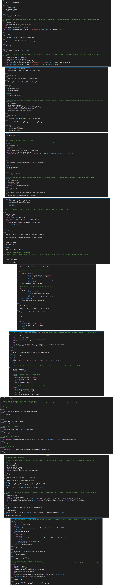

# Supply Chain Performance Analysis
**Tools:** SQL Server | CTEs | Window Functions  
**Type:** Advanced SQL Analysis  
**Industry:** Supply Chain & Logistics

## Project Overview
Conducted advanced SQL analysis of supply chain 
operations covering delivery performance, order 
fulfilment, supplier analysis, shipping efficiency 
and late delivery risk detection.

## Queries Covered

### Basic Analysis
- Product and category exploration
- Order volume and total sales analysis
- Average order value by customer segment
- Orders by shipping mode

### Intermediate Analysis
- Late delivery detection and risk flagging
- Profit margin analysis by product category
- Customer segmentation by purchase frequency
- Supplier performance ranking
- Order fulfilment rate calculation

### Advanced Analysis
- CTE based delivery performance analysis
- Window functions for sales ranking
- Rolling averages for trend analysis
- ABC Pareto classification for products
- Customer lifetime value calculation
- Shipping cost vs order value analysis
- Market and regional performance breakdown

### Business Intelligence Queries
- Top performing products by profit
- Late delivery risk by shipping mode
- Customer retention and churn detection
- Month over month revenue growth
- Supplier reliability scoring

## Skills Demonstrated
- Complex SQL JOINs
- CTEs (Common Table Expressions)
- Window Functions (RANK, ROW_NUMBER, LAG)
- CASE WHEN statements
- Subqueries and nested queries
- Aggregate functions
- Date functions
- Business logic implementation in SQL

## Query Preview

